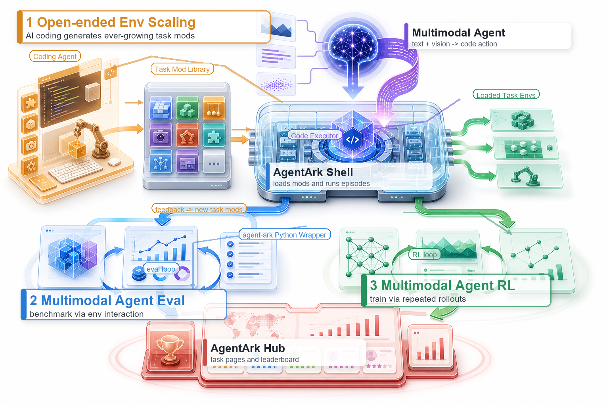

# AgentArk

AgentArk is an open environment framework for multimodal agents: models can see
interactive tasks, write actions as code or tool calls, receive verifiable
feedback, and improve through evaluation, replay, or RL.

The goal is not to freeze one benchmark. AgentArk is built as infrastructure for
continuously growing interactive tasks. Its base environment can load arbitrary
task mods, while each mod defines its own scene, prompt, observations, actions,
scoring rules, and termination conditions. Coding agents can help turn new task
ideas into verified mods; the same tasks can then be used for multimodal model
evaluation, trace replay, and reinforcement learning.

This repository provides the Python package for runtime control, model
evaluation, replay, environment serving, and RL training integration. Public
runtime builds, task mods, and example replay/evaluation records are available at
[P90-RushB/AgentArk on Hugging Face](https://huggingface.co/datasets/P90-RushB/AgentArk).

## Try AgentArk First

You do not need to install the local runtime before seeing what AgentArk can do.
Start with the Hub and the Colab tutorials:

| Entry | What it is for |
| --- | --- |
| [AgentArk Hub](https://p90-rushb.github.io/agentark-hub/) | Browse released tasks, preview media, public scoreboards, model results, and artifact links. |
| [01_human_play_tutorial.ipynb](https://colab.research.google.com/drive/1OdGgcjtNUO5V4W935Qzm1760mO5V_vF1?usp=drive_link) | Play and debug AgentArk tasks manually from Colab. |
| [02_model_replay_tutorial.ipynb](https://colab.research.google.com/drive/12rypa1bzmtErXMZ1GJAI8qGzCYAfViQI?usp=drive_link) | Replay saved model actions without calling a model API again. |
| [03_online_evaluation_tutorial.ipynb](https://colab.research.google.com/drive/1hP1OxjbboxEa5rvySwo5UWLT_Wn-PxsK?usp=drive_link) | Run online API evaluation against AgentArk tasks. |
| [04_rl_training_tutorial.ipynb](https://colab.research.google.com/drive/1ktAtXJLyi99FteZpdwnBcF6AiCSvOn4i?usp=drive_link) | Launch the RL training workflow around the AgentArk env server. |
| [Hugging Face artifacts](https://huggingface.co/datasets/P90-RushB/AgentArk) | Download runtime builds, task mods, replay records, and registries. |

## What AgentArk Enables

- **Task scaling with coding agents.** New environments are packaged as task
  mods, so designers, builders, and reviewers can expand the task library
  without changing the core runtime.
- **Multimodal task evaluation.** Models interact with visual and textual state,
  receive score and error feedback, and produce replayable traces for analysis.
- **Multimodal agent training.** The same runtime and task definitions can be
  served over HTTP for RL frameworks, including the current verl GRPO
  integration.
- **A broad task surface.** AgentArk is designed for 2D and 3D scenes, physics
  calibration, timing control, path planning, video-level observation,
  mini-games, GUI-like tasks, and future task families that can be expressed as
  loadable mods with verifiable scoring.

<p align="center">
  
</p>

## Documentation Map

- Environment setup: [docs/setup.md](docs/setup.md)
- System paper: [docs/paper/AgentArk.pdf](docs/paper/AgentArk.pdf)
- Colab tutorials: [docs/tutorials](docs/tutorials)
- Model evaluation and replay: [docs/evaluation-guide.md](docs/evaluation-guide.md)
- RL training with verl: [docs/rl-training.md](docs/rl-training.md)
- Runtime sandbox details: [docs/runtime-sandbox-migration.md](docs/runtime-sandbox-migration.md)

## 1. Environment Setup

AgentArk currently uses Python 3.10.12 or an earlier Python 3.10 patch version
for the runtime wrapper, evaluation, replay, and env server processes. Python
3.10.12 is recommended.

```bash
git clone https://github.com/P90-RushB/AgentArk.git
cd AgentArk
python3.10 -m venv .venv
source .venv/bin/activate
python -m pip install -U pip
python -m pip install -e .
```

On Windows PowerShell:

```powershell
git clone https://github.com/P90-RushB/AgentArk.git
cd AgentArk
py -3.10 -m venv .venv
.\.venv\Scripts\Activate.ps1
python -m pip install -U pip
python -m pip install -e .
```

Download a matching AgentArk runtime from Hugging Face. Current release:
`env-1.0.1`. The packaged runtime includes 32 starter tasks. Use the Hugging
Face CLI command `hf download`; install the CLI first if `hf` is not available.

```bash
# Linux
hf download P90-RushB/AgentArk \
  --type dataset \
  --include artifacts/envs/1.0.1/linux/AgentArk-env-1.0.1-linux.zip \
  --local-dir downloads/agentark-assets

# Windows
hf download P90-RushB/AgentArk \
  --type dataset \
  --include artifacts/envs/1.0.1/windows/AgentArk-env-1.0.1-windows.zip \
  --local-dir downloads/agentark-assets
```

You can also download directly from:

- Linux: `https://huggingface.co/datasets/P90-RushB/AgentArk/resolve/main/artifacts/envs/1.0.1/linux/AgentArk-env-1.0.1-linux.zip`
- Windows: `https://huggingface.co/datasets/P90-RushB/AgentArk/resolve/main/artifacts/envs/1.0.1/windows/AgentArk-env-1.0.1-windows.zip`

Copy `.env.example` to `.env` and point it at the extracted runtime:

```bash
cp .env.example .env
```

Important variables:

```dotenv
AGENTARK_ENV_PATH=/path/to/AgentArk-env-1.0.1-linux/AgentArk.x86_64
AGENTARK_MOD_PATH=/path/to/AgentArk-env-1.0.1-linux/AgentArk_Data/Resources/Mods
AGENTARK_TASK_STORE_PATH=${AGENTARK_MOD_PATH}/all_tasks
AGENTARK_RUNTIME_TEMPLATE_ROOT=/path/to/AgentArk-env-1.0.1-linux
AGENTARK_RUNTIME_POOL_ROOT=/tmp/agentark_runtime_pool
MLAGENTS_PYTHON_BIN=/path/to/python3.10
```

On Windows, `AGENTARK_ENV_PATH` may point to either the runtime directory or
the `.exe`; `AGENTARK_MOD_PATH` should point to
`AgentArk_Data\Resources\Mods`.

For headless Linux servers, install Xvfb before running visual tasks:

```bash
sudo apt update
sudo apt install -y xvfb
```

See [docs/setup.md](docs/setup.md) for platform-specific extraction commands,
task mod installation, and a smoke test.

## 2. Model Evaluation

Set an API key for the provider used by your eval config. For example, if you
use the default OpenRouter-style example config:

```bash
export OPENROUTER_API_KEY=...
```

For other OpenAI-compatible providers, change `models[*].provider`,
`models[*].base_url`, and `models[*].api_key_env` or set `models[*].api_key`
directly in your local config.

Edit [config/ark_env/eval_seed1.example.yaml](config/ark_env/eval_seed1.example.yaml)
so `eval.cases[*].task_name` exists in your runtime and `models[*]` matches your
OpenAI-compatible provider. Then run:

```bash
python -m agent_ark.ark_eval.run_api_agent \
  --config config/ark_env/eval_seed1.example.yaml
```

For multiple seeds:

```bash
python -m agent_ark.ark_eval.run_api_agent \
  --config config/ark_env/eval_seeds_1_n.example.yaml
```

For parallel model/seed evaluation across multiple isolated Unity runtimes:

```bash
python -m agent_ark.ark_eval.run_parallel_api_eval \
  --config config/ark_env/parallel_api_eval.example.yaml
```

When `eval.max_parallel_envs > 1`, keep
`env_cfg.runtime_sandbox.enabled: true`. Each worker gets a private writable
runtime while sharing task assets through `Mods/all_tasks`.

Saved JSONL records can be replayed without calling a model:

```bash
python -m agent_ark.ark_eval.run_replay \
  --config config/ark_env/replay.example.yaml \
  --records tmp/DelayTrain_seed1_5.jsonl \
  --index 0
```

AgentArk Hub is also useful after an eval run: it shows the public task catalog
and aggregate scoreboards, while this repository stores your local JSONL results.
The evaluation guide covers model configs, browser visualization, human
interaction, scoring fields, trajectory save/load, and replay:
[docs/evaluation-guide.md](docs/evaluation-guide.md).

## 3. RL Training

AgentArk provides the env server side. The verl GRPO integration lives in the
public fork [P90-RushB/verl](https://github.com/P90-RushB/verl), branch
`agentark_rl`, under
[`agentark_recipe/agentark_env_agent`](https://github.com/P90-RushB/verl/tree/agentark_rl/agentark_recipe/agentark_env_agent).

The runtime wrapper and env server run in the AgentArk Python 3.10.12
environment. The verl trainer can run in its own Python environment because it
talks to AgentArk over HTTP.

Start the env server from the AgentArk checkout:

```bash
bash scripts/run_env_server_mlagents.sh
```

Warm up the pool:

```bash
python -m agent_ark.ark_env.serving.warmup_envs \
  --config config/ark_env/agentark_runtime_config.example.yaml \
  --output tmp/warmup_snapshot.json
```

Check health:

```bash
curl http://127.0.0.1:18080/health
curl http://127.0.0.1:18080/v1/envs
```

Then follow the verl integration guide to generate the dataset and launch GRPO
training:
[docs/rl-training.md](docs/rl-training.md).

## Future Development

The long-term goal of AgentArk is model-environment co-evolution: agents find
their own capability gaps, propose new tasks, implement and verify task modules,
train on those environments, and then generate harder tasks from their failures.

Near-term development will focus on:

- **1k+ task scale in 2026.** Grow the public task store from the current
  starter suite to more than one thousand reproducible, trainable task mods.
- **Dynamic curriculum.** Select tasks based on model success rates, error
  types, task parameters, and capability coverage.
- **Long-horizon memory.** Compress observations, actions, scores, and error
  analysis for tasks with long interaction histories.
- **Richer environment sources.** Combine generated assets, 3D generation, and
  world models with AgentArk's verifiable task logic.
- **Stronger Hub artifacts.** Improve task/runtime versioning, trace artifacts,
  download links, and public model reports.

## Package Layout

- `agent_ark.ark_env`: Unity runtime lifecycle, task reset/step protocol,
  runtime sandboxing, env server, warmup, and HTTP client utilities.
- `agent_ark.ark_eval`: API model evaluation, parallel evaluation, replay, and
  trajectory save/load.
- `agent_ark.ark_rl`: reserved namespace for future in-package RL adapters; the
  current RL training implementation is in the verl fork.
- `agent_ark.interaction`: local browser viewer and human-interaction hooks.

## Licensing

The Python package in this repository is Apache-2.0. Runtime builds, task mods,
and records on Hugging Face are distributed under the license stated on the
dataset card, currently CC BY-NC 4.0 unless otherwise noted.
