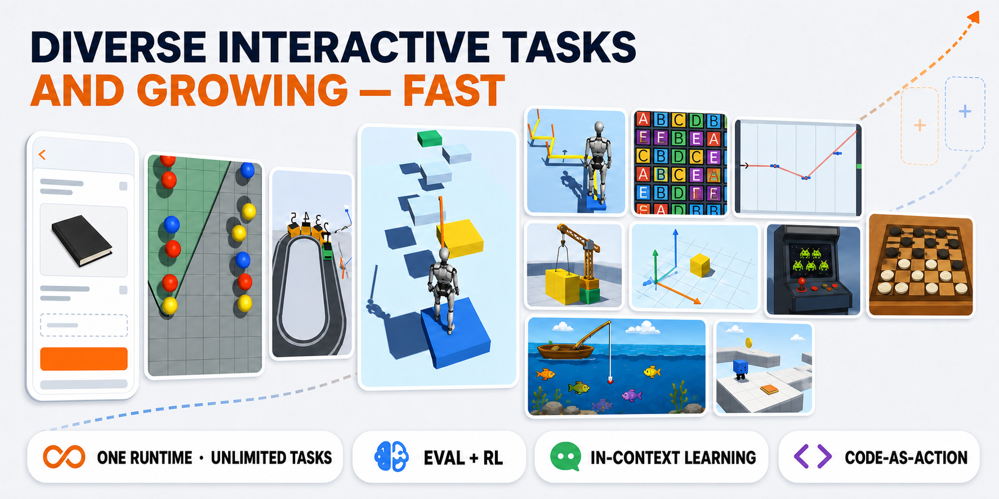

# AgentArk

[English](README.md) | 简体中文

<p align="center">
  
</p>

AgentArk 是一个面向多模态智能体的开放环境框架：模型可以观察交互式任务，
以代码或工具调用的形式生成动作，接收可验证的反馈，并通过评测、轨迹回放或
强化学习持续改进。

AgentArk 的目标不是固化一套静态 benchmark，而是为持续增长的交互式任务提供
基础设施。基础环境可以加载任意任务 Mod；每个 Mod 独立定义场景、提示词、观测、
动作、评分规则和终止条件。Coding Agent 可以协助把新的任务创意实现为经过验证的
Mod，同一批任务随后可用于多模态模型评测、轨迹回放和强化学习。

本仓库提供用于运行时控制、模型评测、回放、环境服务和强化学习集成的 Python 包。

## AgentArk 能做什么

<p align="center">
  
</p>

- **借助 Coding Agent 扩展任务。** 新环境以任务 Mod 的形式打包，设计者、构建者和
  审查者可以扩展任务库，而不必修改核心运行时。
- **多模态任务评测。** 模型与视觉和文本状态交互，接收分数及错误反馈，并生成可回放
  的轨迹用于分析。
- **多模态智能体训练。** 同一套运行时和任务定义可以通过 HTTP 提供给强化学习框架，
  包括 ms-swift 和 verl GRPO 集成。
- **广泛的任务类型。** AgentArk 面向 2D/3D 场景、物理校准、时序控制、路径规划、
  视频级观测、小游戏、GUI 类任务，以及未来任何能够用可加载 Mod 和可验证评分表达的
  任务类型。

## 先体验 AgentArk

无需先安装本地运行时也可以了解 AgentArk。建议从 Hub、Kaggle benchmark 和 Colab
教程开始：

| 入口 | 用途 |
| --- | --- |
| [AgentArk Hub](https://p90-rushb.github.io/agentark-hub/) | 浏览已发布任务、预览媒体、公开排行榜、模型结果和 artifacts 链接。 |
| [Kaggle 上的 AgentArk Bench](https://www.kaggle.com/benchmarks/xunyiljg/agentark-bench) | 在 Kaggle Benchmarks 上运行和比较持续增加的 AgentArk 任务。 |
| [01_human_play_tutorial.ipynb](https://colab.research.google.com/drive/1OdGgcjtNUO5V4W935Qzm1760mO5V_vF1?usp=drive_link) | 在 Colab 中手动游玩和调试 AgentArk 任务。 |
| [02_model_replay_tutorial.ipynb](https://colab.research.google.com/drive/12rypa1bzmtErXMZ1GJAI8qGzCYAfViQI?usp=drive_link) | 无需再次调用模型 API，直接回放已保存的模型动作。 |
| [03_online_evaluation_tutorial.ipynb](https://colab.research.google.com/drive/1hP1OxjbboxEa5rvySwo5UWLT_Wn-PxsK?usp=drive_link) | 对 AgentArk 任务执行在线 API 模型评测。 |
| [04_rl_training_tutorial.ipynb](https://colab.research.google.com/drive/1ktAtXJLyi99FteZpdwnBcF6AiCSvOn4i?usp=drive_link) | 围绕 AgentArk 环境服务启动强化学习训练流程。 |
| [Hugging Face artifacts](https://huggingface.co/datasets/P90-RushB/AgentArk) | 下载运行时构建、任务 Mod、回放记录和 registry。 |

Kaggle 评测通过其 OpenAI 兼容的 Model Proxy 运行。排行榜评测在端点允许时使用
`temperature: 1.0`；对于不允许指定该参数的模型则省略 temperature。AgentArk Hub
最初的本地排行榜使用 `temperature: 0.0`，因此两处结果采用了不同的评测设置，
不应被视为完全相同的运行并直接比较。

## 文档导航

- 环境安装：[docs/setup.zh-CN.md](docs/setup.zh-CN.md)
- 系统论文：[docs/paper/AgentArk.pdf](docs/paper/AgentArk.pdf)
- Colab 教程：[docs/tutorials/README.zh-CN.md](docs/tutorials/README.zh-CN.md)
- 模型评测与回放：[docs/evaluation-guide.zh-CN.md](docs/evaluation-guide.zh-CN.md)
- 使用 ms-swift 或 verl 进行强化学习训练：[docs/rl-training.zh-CN.md](docs/rl-training.zh-CN.md)
- 运行时沙箱说明：[docs/runtime-sandbox-migration.zh-CN.md](docs/runtime-sandbox-migration.zh-CN.md)

## 1. 安装

AgentArk 的本地评测、回放和环境服务需要本仓库中的 Python 包，以及 Hugging Face
上与之匹配的 Unity 打包运行时。当前运行时版本为 `env-1.0.1`，包含 32 个首发任务。

安装、运行时下载、本地路径配置和冒烟测试请参阅
[docs/setup.zh-CN.md](docs/setup.zh-CN.md)。

## 2. 模型评测

对于 OpenAI 兼容的 HTTP provider，请设置评测配置所使用 provider 的 API key。
例如，使用默认的 OpenRouter 风格示例配置时：

```bash
export OPENROUTER_API_KEY=...
```

使用其他 OpenAI 兼容 HTTP provider 时，请修改 `models[*].provider`、
`models[*].base_url` 和 `models[*].api_key_env`，或直接在本地私有配置中设置
`models[*].api_key`。

也可以通过 `provider: codex` 使用 Codex SDK 评测。Codex 安装、模型配置和消息上下文
设置请参阅 [docs/evaluation-guide.zh-CN.md](docs/evaluation-guide.zh-CN.md)。

编辑 [config/ark_env/eval_seed1.example.yaml](config/ark_env/eval_seed1.example.yaml)，
确保 `eval.cases[*].task_name` 存在于运行时中，并让 `models[*]` 与所选 provider
一致。然后运行：

```bash
python -m agent_ark.ark_eval.run_api_agent \
  --config config/ark_env/eval_seed1.example.yaml
```

评测多个 seed：

```bash
python -m agent_ark.ark_eval.run_api_agent \
  --config config/ark_env/eval_seeds_1_n.example.yaml
```

使用多个隔离的 Unity 运行时并行评测多个模型/seed：

```bash
python -m agent_ark.ark_eval.run_parallel_api_eval \
  --config config/ark_env/parallel_api_eval.example.yaml
```

当 `eval.max_parallel_envs > 1` 时，请保持
`env_cfg.runtime_sandbox.enabled: true`。每个 worker 会获得私有的可写运行时，
任务资源则通过 `Mods/all_tasks` 共享。

已保存的 JSONL 记录可以在不调用模型的情况下回放：

```bash
python -m agent_ark.ark_eval.run_replay \
  --config config/ark_env/replay.example.yaml \
  --records tmp/DelayTrain_seed1_5.jsonl \
  --index 0
```

完成评测后也可以使用 AgentArk Hub：它展示公开任务目录和聚合排行榜，本仓库则保存
你的本地 JSONL 结果。模型配置、浏览器可视化、人工交互、评分字段、轨迹保存/加载和
回放详见 [docs/evaluation-guide.zh-CN.md](docs/evaluation-guide.zh-CN.md)。

## 3. 强化学习训练

AgentArk 通过 HTTP 将 Unity runtime pool 提供给多轮、多模态强化学习。
runtime wrapper 和 Env Server 使用 AgentArk Python 3.10.12 环境，每个 trainer
则保持自己的 Python 环境和依赖栈。

目前提供两种 GRPO 集成：

- [ms-swift](integrations/ms_swift/README.md)：在本仓库中维护。
- [VERL](integrations/verl/README.zh-CN.md)：trainer 侧实现位于公开
  `agentark_rl` fork。

从[强化学习集成索引](integrations/README.zh-CN.md)开始选择框架，并按相应的
端到端运行指南操作。共享架构、GRPO 分组和任务选择语义见
[强化学习训练说明](docs/rl-training.zh-CN.md)。

## 后续规划

AgentArk 的长期目标是实现模型与环境共同演化：智能体识别自身能力缺口、提出新任务、
实现并验证任务模块、在这些环境中训练，再根据失败生成更困难的任务。

近期开发重点包括：

- **2026 年达到 1K+ 任务规模。** 将公开任务库从当前首发套件扩展到一千个以上
  可复现、可训练的任务 Mod。
- **动态课程。** 根据模型成功率、错误类型、任务参数和能力覆盖情况选择任务。
- **长程记忆。** 为长交互历史的任务压缩观测、动作、分数和错误分析。
- **更丰富的环境来源。** 将生成式资产、3D 生成和世界模型与 AgentArk 可验证的
  任务逻辑结合。
- **更完善的 Hub artifacts。** 改善任务/运行时版本管理、轨迹 artifacts、下载链接
  和公开模型报告。

## 包结构

- `agent_ark.ark_env`：Unity 运行时生命周期、任务 reset/step 协议、运行时沙箱、
  环境服务、预热和 HTTP client 工具。
- `agent_ark.ark_eval`：API 模型评测、并行评测、回放以及轨迹保存/加载。
- `integrations`：RL 框架 adapter 与运行指南；VERL trainer 侧 recipe 仍位于其
  公开 fork 中。
- `agent_ark.interaction`：本地浏览器 viewer 和人工交互 hook。

## 许可证

本仓库中的 Python 包采用 Apache-2.0 许可证。Hugging Face 上的运行时构建、任务 Mod
和记录遵循 dataset card 中声明的许可证；当前若无其他说明，为 CC BY-NC 4.0。
