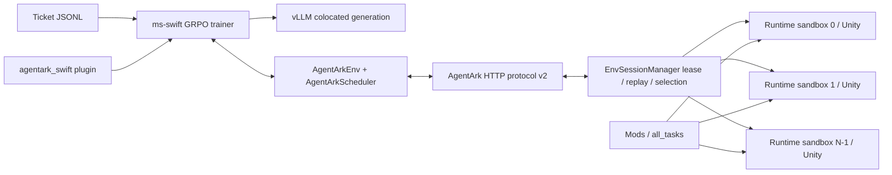
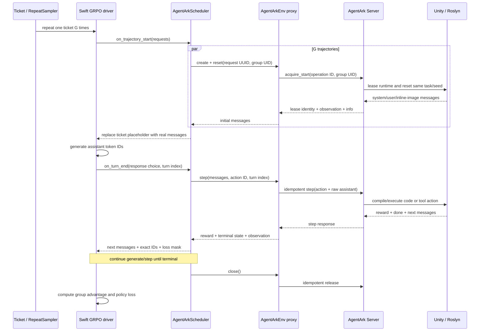

# AgentArk × ms-swift Architecture and Implementation Semantics

English | [简体中文](ARCHITECTURE.zh-CN.md)

This document is for developers who maintain the adapter, diagnose trajectories,
or design scaling changes. It explains how AgentArk integrates with ms-swift, how a
GRPO rollout moves from a ticket through Unity and back into policy loss, and how
this path differs from the existing VERL recipe. The README and launcher are the
source of truth for validated versions.

Installation and training commands live in the [runbook](README.md). For a complete
single-task example, see the [Snake tutorial](tutorial/README.md).

## 1. Integration design and boundaries

The integration uses a **native Swift Gym Env, a custom multi-turn Scheduler, and
the AgentArk HTTP Server**:

- the AgentArk Server runs in the Python 3.10 environment, while the Swift trainer
  runs in Python 3.12;
- the Gym Env exchanges multimodal messages, actions, rewards, and lease identities;
  AgentArk owns task selection, reset/step, and the runtime pool;
- protocol v2 provides lease generations, idempotent acquire/step/release operations,
  batched heartbeat, and TTL recovery;
- the adapter is model-agnostic, but the selected model must be supported by the
  active Swift template/processor and inference backend and must emit AgentArk actions;
- the launcher supports LoRA and full training with single-host multi-GPU preflight.

The repository smoke baseline is single-GPU. The Snake tutorial documents a complete
eight-GPU run-through, but every larger setup must be recalibrated for its model,
CPU, memory, GPU topology, and Unity startup behavior.

Within one generation batch, reset and step calls wait concurrently through
coroutines. Rollout batches and optimizer updates still alternate synchronously;
this is not a cross-batch asynchronous generation pipeline.

## 2. System architecture



### 2.1 Process boundary

```text
Swift Python 3.12 process
  ├─ ms-swift trainer and inference backend
  ├─ AgentArkScheduler
  ├─ one AgentArkEnv proxy per trajectory
  └─ one heartbeat supervisor per trainer process

                         HTTP

AgentArk Python 3.10 process (one uvicorn worker)
  ├─ FastAPI routes
  ├─ one EnvSessionManager
  ├─ task and seed selector
  ├─ protocol v1 pool namespace
  └─ protocol v2 pool namespace
       └─ N isolated runtime sandboxes and Unity processes
```

“One Server process” means that one logical pool is owned by one
`EnvSessionManager`. Do not place several uvicorn workers behind random routing for
the same in-memory lease pool. It does not mean one Unity instance: one Server can
manage `runtime_sandbox.pool_size=N` isolated runtimes concurrently.

### 2.2 Python environment isolation

Unity and ML-Agents dependencies stay in AgentArk's Python 3.10 environment. The
Swift adapter uses the Server over HTTP from Python 3.12. This separation:

- avoids forcing ML-Agents and its NumPy constraints into the trainer;
- isolates Unity crashes from the model process;
- lets several RL frameworks use the same AgentArk service contract;
- implements runtime pooling, task selection, and recovery only once.

## 3. The dataset contains rollout tickets, not prompts

A Swift JSONL row looks like:

```json
{"messages":[{"role":"user","content":"<agentark-ticket:exp01:00000000>"}],"env_config":{"name":"agentark","group_uid":"exp01:00000000"}}
```

The row has three jobs:

1. provide Swift with a valid and unique sample row;
2. select the AgentArk Gym Env through `env_config.name=agentark`;
3. identify one GRPO prompt group through `group_uid`.

The placeholder message is not the real training prompt.
`AgentArkScheduler.on_trajectory_start()` resets Unity and replaces it with the
complete system, user, and inline-image messages returned by the environment.

### 3.1 Identifier roles

| Identifier | Owner | Scope | Purpose |
| --- | --- | --- | --- |
| `run_id` | launcher | one experiment | Names generated data and output |
| `group_uid` | ticket | one GRPO prompt group | Selects a stable task and seed |
| Swift request UUID | Swift | one trajectory | Distinguishes sibling trajectories |
| `client_id` | adapter | one trainer process | Separates clients and changes after fork |
| `acquire_request_id` | adapter | one acquire operation | Makes acquire replay-safe |
| `env_id` | Server | one runtime | Identifies the leased Unity runtime |
| `lease_id` + generation | Server | one lease capability | Fences stale owners |
| `action_id` | adapter | one step operation | Makes safe step retries idempotent |
| `release_request_id` | adapter | one release operation | Makes cleanup replay-safe |

Sibling trajectories share `group_uid`, task, and seed, but must have distinct
request UUIDs, operations, and Unity leases.

### 3.2 Capacity across epochs

Let:

```text
B = per_device_train_batch_size × world_size
A = gradient_accumulation_steps
D = generation_batch_size (B × A when omitted)
S = D / B
K = num_iterations
G = num_generations
M = max_steps
```

Then:

```text
rollout_generation_calls = ceil(M × A / (K × S))
unique_groups_per_call   = D / G
required_unique_rows     = rollout_generation_calls × unique_groups_per_call
```

The launcher asks `check_ticket_capacity.py` to compute and validate this capacity.
Resume the same experiment with the original dataset and run ID. Generate a new run
ID for an independent experiment.

An infinite online curriculum, a new identity per dataset occurrence, or dynamic
task selection based on live capability would require a sampler occurrence ID or a
server-side curriculum version. Those are future extensions, not prerequisites for
increasing the step count of the current design.

## 4. What the launcher does before training

`run_agentark_grpo.sh` performs these operations before starting Swift:

1. validates the Swift Python, CLI, model, plugin, and runtime configuration;
2. checks the installed ms-swift version against the adapter contract;
3. computes ticket capacity from batch, accumulation, G, iterations, and steps;
4. atomically generates tickets when no dataset is supplied;
5. validates ticket uniqueness, group completeness, and task/seed constraints;
6. derives `required_idle=generation_batch_size`;
7. checks that the selected protocol pool contains enough started, idle runtimes;
8. adds the adapter and compatibility shim to `PYTHONPATH`;
9. starts `swift rlhf` and loads the external plugin;
10. registers the Env and Scheduler and installs rollout-boundary cleanup.

Ticket and Unity-capacity failures therefore happen before the model occupies GPU
memory.

## 5. One complete multi-turn rollout



### 5.1 Reset

`AgentArkEnv.reset()` reads the group identity from the ticket, derives an independent
acquire operation from the Swift request UUID, acquires a runtime, registers its
lease for heartbeat, and returns the complete multimodal initial transcript.

The Scheduler resets sibling requests concurrently and replaces every placeholder
prompt. A partial group is invalid: if one sibling fails during acquire, already
acquired siblings from the same startup batch are cleaned up.

### 5.2 Generate and step

Swift generates assistant content and exact token IDs. The Scheduler extracts the
task action while retaining the raw assistant message, then calls the Server with a
stable `action_id` and turn index. AgentArk executes the action and returns reward,
terminal state, info, and only the new environment-message delta.

The Scheduler removes any echoed assistant message from the environment response,
appends new user/tool/image messages, and continues generation if the trajectory is
not terminal.

### 5.3 Reward, termination, and loss mask

The Scheduler accumulates step rewards and returns the total reward through rollout
info. A trajectory ends on environment `done`, length truncation, the maximum turn,
or an exception. Every path attempts to unregister heartbeat and release the lease.

`AGENTARK_ASSISTANT_LOSS_SCOPE=all_turns` assigns a loss mask of one to every sampled
assistant token. `last_round` masks earlier assistant rounds and keeps only the final
round. Environment observations are always excluded. The launcher keeps Swift's
generic `loss_scale` at its default so that it does not add another masking policy.

## 6. Multimodal and exact-token path

### 6.1 Swift path

Inference-generated assistant token IDs are the source of truth. The Scheduler may
materialize text for action parsing and messages, but it returns the original IDs and
an aligned response loss mask. The official upstream exact-token work ensures these
IDs survive agentic continuation and multimodal training-input reconstruction.

The important invariant is:

```text
tokens used by policy loss == tokens sampled by the inference backend
```

Image and text observations remain structured OpenAI content blocks. Inline images
are neither copied into the static ticket dataset nor decoded by the adapter.

### 6.2 VERL path

The current VERL recipe owns more of the agent loop inside its trainer integration and
currently uses AgentArk protocol v1. Its token and multimodal assembly path is not the
same implementation as the Swift Scheduler. Do not infer that a switch or patch in
one framework changes the other.

## 7. Protocol v2 lifecycle and failure recovery

### 7.1 Idempotent acquire, step, and release

Acquire, step, and release use stable operation IDs. The client retries only requests
that are safe to replay. The Server caches compatible results and rejects conflicting
replays instead of executing an action twice.

### 7.2 Generation fencing

Every lease has a server epoch, lease ID, and generation. A request from a previous
owner cannot act on a runtime after that runtime is released and leased again. Stale
capabilities return a conflict or gone response and invalidate only that trajectory.

### 7.3 Heartbeat and abnormal process exit

One supervisor per trainer process batches heartbeat for active leases. Each lease
also has a local deadline so prolonged heartbeat failure fences the next step before
the client unknowingly acts with an expired capability.

Normal terminal and exception paths release immediately. If OOM, `SIGKILL`, or host
failure prevents Python cleanup, the Server TTL reaper eventually returns the runtime
to the idle pool. Rollout-boundary cleanup is an additional best-effort guard, not a
replacement for protocol TTL.

## 8. Comparison with the VERL integration

| Dimension | VERL recipe | ms-swift adapter |
| --- | --- | --- |
| Location | External `agentark_rl` fork | This repository |
| Current AgentArk protocol | v1 | v2 by default; v1 compatibility remains |
| Trainer integration | Custom agent loop and recipe | Native Gym Env and multi-turn Scheduler |
| Runtime ownership | AgentArk Server | AgentArk Server |
| Group identity | Recipe dataset and loop | JSONL ticket `group_uid` |
| Exact-token path | Implemented in the VERL loop | Official Swift rollout plus Scheduler masks |
| Failure recovery | Recipe cleanup and v1 pool behavior | Idempotent v2 operations, heartbeat, TTL, cleanup |
| Configuration | Ray/FSDP/vLLM/Hydra recipe | Swift launcher, tickets, and preflight |

Both preserve the central AgentArk boundary: task selection, task/seed consistency,
Unity runtime ownership, and sandbox lifecycle remain in the AgentArk Server instead
of being duplicated inside each trainer.

## 9. File and module responsibilities

### 9.1 User-facing scripts

| File | Responsibility |
| --- | --- |
| `scripts/run_agentark_server.sh` | Start the single-worker Server with AgentArk Python |
| `scripts/check_agentark_server.py` | Read-only health, namespace, idle, and active checks |
| `scripts/smoke_agentark_unity.sh` | Prepare the minimum v2 pool and run sibling-parity smoke |
| `scripts/smoke_unity_group.py` | Concurrent acquire/reset and task, seed, message, image checks |
| `scripts/generate_tickets.py` | Atomically generate unique group tickets |
| `scripts/check_ticket_capacity.py` | Validate group capacity and batch divisibility |
| `scripts/run_agentark_grpo.sh` | Run preflight and start single-host LoRA/full GRPO |
| `scripts/compat/sitecustomize.py` | Inject the validated causal-conv1d compatibility fallback |

### 9.2 Swift adapter modules

| File | Responsibility |
| --- | --- |
| `plugin.py` | Register Env/Scheduler and install rollout cleanup |
| `env.py` | Resolve runtime config and implement reset/step/close |
| `scheduler.py` | Batch reset, message injection, reward, masks, and cleanup |
| `client.py` | v1/v2 HTTP client, stable operation IDs, and safe retries |
| `heartbeat.py` | Lease handle, local deadline, and process-level heartbeat |
| `messages.py` | Validate messages, extract actions, and remove assistant echo |
| `rollout_cleanup.py` | Add version-gated rollout-boundary finalization |

### 9.3 AgentArk Server modules

| File | Responsibility |
| --- | --- |
| `env_server.py` | FastAPI v1/v2 routes and stable error responses |
| `session_manager.py` | Runtime pool, leases, replay, TTL reaper, and fencing |
| `lease_protocol.py` | v2 identities, records, tombstones, and error types |
| `warmup_envs.py` | Build v1/v2 pools and release warmed v2 leases together |

### 9.4 Configuration, packaging, and tests

Configuration templates, generated-data ignore rules, packaging metadata, and tests
live beside the adapter so the integration remains independently testable.

## 10. Scaling invariants

The [runbook](README.md) owns concrete commands. Scaling without adapter changes is
safe only when all of these invariants remain true:

- `generation_batch_size` is divisible by `num_generations` and global train batch;
- runtime pool size and v2 warmup count are at least `generation_batch_size`;
- ticket capacity satisfies the generation-reuse formula in section 3.2;
- vLLM context covers the training sequence and per-round completion;
- model memory, visual-token count, and inference memory are jointly budgeted;
- changing runtime configuration is followed by a Server restart and pool rebuild.

Increasing only `G=num_generations` does not exceed generation-batch concurrency, but
it changes the number of unique groups per rollout batch and still requires
`D % G == 0`. Idle preflight currently filters by protocol namespace, not by a runtime
configuration fingerprint, so incompatible configurations must not share one Server.

The following changes require additional implementation rather than configuration:

- several Env Server processes sharing one pool or sitting behind random routing;
- multi-host Server routing or a durable centralized lease store;
- multi-node Swift training beyond the launcher's local `NPROC_PER_NODE` mapping;
- vLLM server mode;
- dynamic sampling and sequence-parallel modes rejected by the launcher;
- a new group identity for every occurrence in an unbounded dataset;
- online curriculum changes from live success rates;
- durable exactly-once behavior across complete Server loss;
- atomic reservation when several training jobs compete for one pool;
- generation batches beyond the practical FastAPI endpoint thread capacity;
- tuner types other than the validated LoRA/full paths.

## 11. Runtime capacity is not only GPU capacity

When increasing Unity concurrency, also measure:

- CPU use from Xvfb/llvmpipe and Unity update/render loops;
- resident memory per runtime;
- sandbox disk and link behavior;
- isolation of ML-Agents base ports;
- reset and step P95/P99 latency;
- cold-start jitter from `max_interactions_per_runtime` recycling;
- whether lease TTL exceeds normal worst-case reset/step latency.

A practical order is to scale the Unity pool first, then G/generation batch, then
training steps, and finally model/context size, validating each stage separately.
