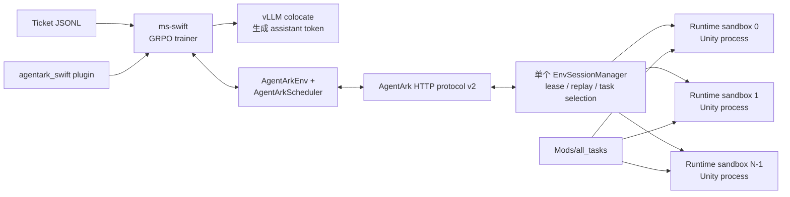
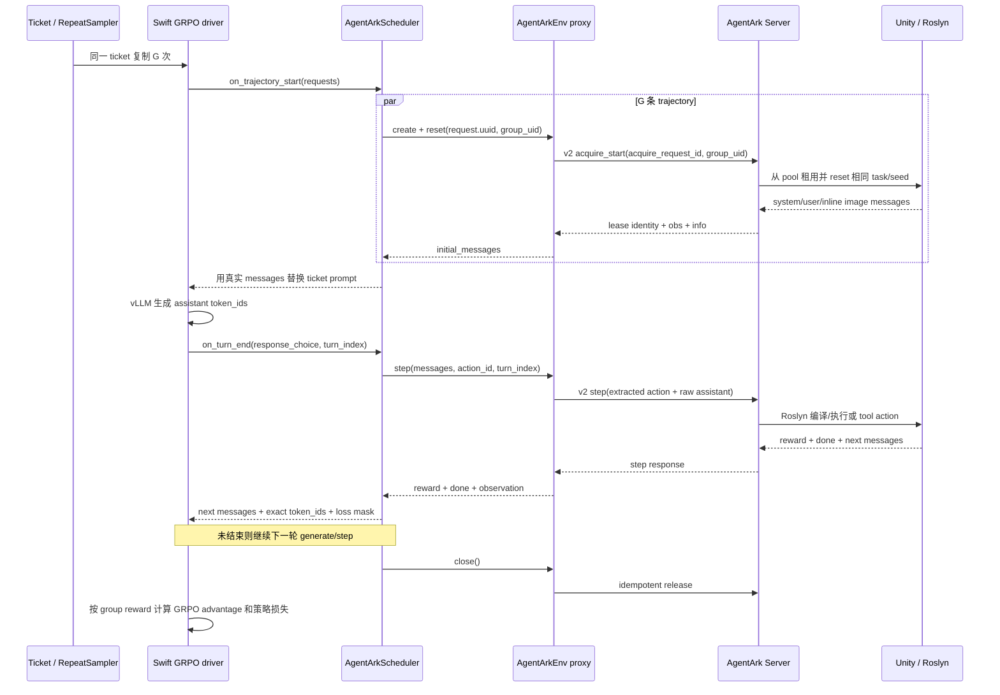

# AgentArk × ms-swift 接入架构与训练流程

本文解释 AgentArk 如何接入 ms-swift、一次 GRPO rollout 从 ticket 到 Unity 再回到
策略损失的完整数据流，以及这套实现与现有 VERL recipe 的区别。当前发布依赖固定并
验证于 ms-swift 4.4.1；下文只在行为与版本直接相关时再次标注版本。

如果你的目标只是安装和运行，请先看 [README.md](README.md)；如果要修改 adapter、
排查多模态轨迹或规划扩容，再阅读本文。

## 1. 接入方案与能力边界

接入采用 **Swift 原生 Gym Env + 自定义多轮 Scheduler + AgentArk HTTP Server**：

- AgentArk Server 使用 Python 3.10，Swift trainer 使用 Python 3.12；
- Swift 侧的 Gym Env 负责交换多模态 messages、action、reward 和 lease，真实
  task/reset/step/runtime pool 由
  AgentArk 管理；
- 默认使用 protocol v2，提供 lease generation、幂等 acquire/step/release、批量
  heartbeat 和 TTL 回收；
- adapter 的消息和环境协议不绑定具体模型；模型需要由当前 Swift template/processor 与
  vLLM 支持，并能生成 AgentArk task 定义的代码或工具 action；
- 通用 launcher 支持 LoRA 和 full，并提供单机多卡参数与预检；当前端到端回归基线为
  单卡，扩大后需按实际 GPU、CPU、内存与 Unity 启动稳定性重新做 smoke。

AgentArk 已经通过独立 Server 提供 runtime sandbox、按 scene/task reset、并发池和任务
选择器，因此 Swift adapter 直接连接这套服务，保留快速 reload 和共享 pool 语义。
Qwen3.5-0.8B LoRA 是测试机器显存条件下使用的端到端回归配置，不代表模型大小或训练
方式上限。

并发与同步边界：同一 generation batch 内，多个 env 的 reset/step 通过协程并发等待；
当前 rollout batch 与 optimizer update 仍同步交替，不使用 `async_generate` 流水线。

## 2. 整体架构



### 2.1 进程边界

```text
Swift Python 3.12 进程
  ├─ ms-swift trainer / vLLM
  ├─ AgentArkScheduler
  ├─ 每条 trajectory 一个 AgentArkEnv proxy
  └─ 每个训练进程一个 heartbeat supervisor

                 HTTP

AgentArk Python 3.10 进程（一个 uvicorn worker）
  ├─ FastAPI routes
  ├─ 一个 EnvSessionManager
  ├─ task/seed selector
  ├─ v1 pool namespace
  └─ v2 pool namespace
       └─ N 个 runtime sandbox / Unity 子进程
```

“env server 单进程”只表示一个逻辑 pool 由一个 `EnvSessionManager` 进程管理，不能
用 `uvicorn --workers 4` 随机分发同一 lease 的请求。它不限制 Unity 数量：一个
server 可以并发管理 `runtime_sandbox.pool_size=N` 个隔离 runtime。

### 2.2 Python 环境隔离

`agent_ark` 的 Unity/ML-Agents 依赖运行在 Python 3.10 环境。Swift adapter 在 Python
3.12 环境中通过 HTTP 使用 Server。因此：

- trainer 不受 ML-Agents、旧 NumPy 等依赖约束；
- Unity 崩溃与模型进程隔离；
- 同一个 AgentArk Server 可以服务不同 RL framework；
- runtime pool、任务管理和回收策略只实现一次。

## 3. 数据集不是 prompt，而是 rollout ticket

一行 Swift JSONL 示例：

```json
{"messages":[{"role":"user","content":"<agentark-ticket:exp01:00000000>"}],"env_config":{"name":"agentark","group_uid":"exp01:00000000"}}
```

这行数据只承担三项职责：

1. 给 Swift sampler 一个合法且唯一的数据行；
2. 用 `env_config.name=agentark` 选择 AgentArk Gym Env；
3. 用 `group_uid` 标记一个 GRPO prompt group。

占位 `messages` 不会成为真实训练 prompt。`AgentArkScheduler.on_trajectory_start()` 在
Unity reset 后，用环境返回的 system/user/inline-image messages 整体替换它。

### 3.1 标识符分工

| 标识符 | 产生位置 | 作用域 | 用途 |
| --- | --- | --- | --- |
| `group_uid` | ticket generator | 一个 GRPO group | 让 G 条 sibling trajectory 选择相同 task/seed |
| `RolloutInferRequest.uuid` | Swift | 一条 trajectory | 区分同组的每条实际 rollout |
| `client_id` | Swift adapter | 一个训练进程 | 区分训练客户端，并在 fork 后重新生成 |
| `acquire_request_id` | adapter，由 `client_id + request.uuid` 稳定派生 | 一次 acquire | 响应丢失后安全重放，不能使用 `group_uid` |
| `env_id` | AgentArk Server | 一个池中 runtime | 定位实际 Unity runtime |
| `lease_id + lease_generation` | AgentArk Server | 一次 runtime 租用 | 阻止旧 trajectory 操作已经重租的 runtime |
| `action_id` | scheduler，`request.uuid:turn` | 一轮 action | 同一 C#/tool action 最多执行一次 |
| `release_request_id` | adapter | 一次 release | release 响应丢失后安全重放 |

Swift 的 `RepeatSampler` 会把一行 ticket 连续复制 `G=num_generations` 次。G 条请求共享
`group_uid`，但具有不同 `request.uuid`，因此会拿到不同 Unity env，同时 reset 到相同
task/seed。

### 3.2 跨 epoch 的处理

同一个静态 ticket 跨 epoch 时会继续映射到相同 task/seed。当前实现不修改 Swift
sampler，而是在启动前计算本次 run 所需的唯一 ticket 数，让计划的 optimizer steps
在第一个 epoch 内消耗完足够多的唯一 group。

这和当前 VERL recipe 有一个明确差异：VERL trainer 每次取到原始 batch occurrence 后
动态生成 UID，再把它复制给该 prompt 的 n 条 sibling rollout；同一 dataset row 下次
出现时会得到新 UID。Swift 的 `group_uid` 则直接存放在 ticket 中，所以同一行再次出现
时不会改变。当前 VERL dataset 若显式写了 `group_seed`，该 seed 仍以数据行为准，不能
简单理解成 task 和 seed 永远都只由新 UID 决定。

令：

```text
B = per_device_train_batch_size × world_size
A = gradient_accumulation_steps
D = generation_batch_size（未设置时为 B × A）
S = D / B
K = num_iterations
G = num_generations
M = max_steps
```

则：

```text
rollout_generation_calls = ceil(M × A / (K × S))
unique_groups_per_call   = D / G
required_unique_rows     = rollout_generation_calls × unique_groups_per_call
```

launcher 会调用 `check_ticket_capacity.py` 计算并校验该值。恢复同一次实验时复用原
dataset/run ID；启动新的独立实验时生成新的 run ID。

如果未来需要无限 epoch、根据在线能力动态改变课程，或要求同一数据行每次 occurrence
获得新 UID，则需要增加 sampler occurrence ID 或服务端 curriculum version；这属于
后续动态任务管理，不是扩大当前 run 步数的前置条件。

## 4. 启动阶段发生了什么

`run_agentark_grpo.sh` 在启动 Swift 前依次执行：

1. 检查 Swift Python、`swift` CLI、模型目录或 Swift 模型 ID、plugin 和 runtime config；
2. 检查已安装的 ms-swift 是否与当前兼容版本一致；
3. 根据 batch、gradient accumulation、G、iterations 和 max steps 计算唯一 ticket 数；
4. 未提供 dataset 时原子生成 JSONL ticket；
5. 校验 ticket 唯一性、分组完整性和 task/seed 约束；
6. 计算同时需要的 Unity trajectory 数 `required_idle=generation_batch_size`；
7. 检查 v2 pool 是否有足够多已经启动且空闲的 Unity env；
8. 将 adapter 与兼容 shim 加入 `PYTHONPATH`；
9. 启动 `swift rlhf`，加载 external plugin；
10. plugin 注册 `agentark` Env、`agentark_scheduler` Scheduler，并安装版本门控的
    rollout-boundary cleanup。

任何 ticket 或 Unity 容量不匹配都会在模型加载前失败，避免模型已经占用 GPU 后才发现
环境不够。

## 5. 一条多轮 rollout 的完整流程



### 5.1 reset

`AgentArkEnv.reset()`：

- 从 ticket 读取 `group_uid/task_name/group_seed`；
- 从 Swift `request.uuid` 派生独立 acquire ID；
- 调用 `/v2/envs/acquire_start`；
- 校验完整 lease identity 和 `obs.messages`；
- 注册 heartbeat；
- 保存真实初始 messages。

`AgentArkScheduler` 随后把 `req.messages` 替换为这些真实 messages，并清空 ticket 上可能
存在的顶层 `images/audios/videos`，防止同一媒体被 Swift 读取两遍。

### 5.2 generate 与 step

Swift/vLLM 从当前完整 messages 生成 assistant。scheduler 保留 vLLM 返回的精确
`response_choice.token_ids`，同时把 assistant 原文交给 `AgentArkEnv.step()`：

- 原文保留在对话历史；
- `extract_action()` 从 `<tool_call>`、`<params>` 或 `<code>` 中提取实际 action；
- v2 step 携带稳定 `action_id=request.uuid:turn` 与严格递增 `turn_index`；
- Server 对相同 action ID/请求体返回缓存结果；相同 ID 不同请求体返回 409；
- Unity 返回的 assistant echo 会被去掉，只把新的 environment user messages 追加到
  下一轮上下文。

### 5.3 reward、终止和 loss mask

每个 Unity step 的 reward 被 scheduler 累加为 `total_reward`，Swift 将 gym reward 作为
GRPO reward 输入，不需要另写一个从文本轨迹解析 reward 的函数。

轨迹在以下任一条件结束：

- Unity 返回 `done=true`；
- 达到 `max_turns`；
- 模型输出因长度截断；
- reset/step 失败；
- Swift rollout boundary 触发最终清理。

策略损失范围由 adapter 的逐 token mask 决定：

- `all_turns`：每轮 assistant token mask 为 1，environment observation 为 0；
- `last_round`：中间 assistant 轮 mask 为 0，最后一轮由 Swift driver 保留为 1。

launcher 固定 `--loss_scale default`，避免再叠一层 Swift 通用 loss scale。

## 6. 多模态与 token 路径

### 6.1 Swift 路径

AgentArk observation 保持 OpenAI messages 格式，例如：

```json
{
  "role": "user",
  "content": [
    {"type": "image_url", "image_url": {"url": "data:image/png;base64,..."}},
    {"type": "text", "text": "..."}
  ]
}
```

adapter 不自行展开视觉 token。Swift template/processor 对当前 messages 做多模态编码，
vLLM 返回本轮真实生成的 assistant token IDs，scheduler 再把这些 ID 和 loss mask 交回
Swift 的 trajectory assembler。当前验证版本在训练编码时会用这些精确 ID 替换对应的
assistant response，而不是简单地把 assistant text 再 tokenize。因此 adapter 处理的
是原始多模态 messages，同时仍保留 assistant 侧的 token-in/token-out 一致性。

这也是 Swift 接入比 VERL recipe 薄的主要原因：动态图片、模板编码和训练轨迹重建由
Swift 的多轮框架负责，adapter 只维护消息顺序、环境边界、精确生成 ID 和 mask。

### 6.2 VERL 路径

现有 VERL `AgentArkEnvAgentLoop` 直接负责 token-in/token-out：

- 把 AgentArk `image_url` 转成 VERL 多模态格式；
- `process_multi_modal_info()` 解码/收集图片；
- `apply_chat_template()` 为初始 prompt 和每轮 observation 产生 token IDs；
- 直接把 `prompt_ids + assistant_ids + observation_ids` 传给 rollout server；
- 手工构造 assistant=1、observation=0 的 `response_mask`；
- 在长度截断时对齐图片数量和 image-token runs。

这给予 VERL agent loop 更直接的 token 级控制，但也意味着多模态模型的动态视觉 token、
图片顺序和截断边界都要由 recipe 显式维护。Qwen3.5 是当前验证样例之一。

## 7. protocol v2 生命周期与故障恢复

### 7.1 acquire/step/release 幂等

- acquire：相同 `acquire_request_id` 和相同请求体只 reset/租用一次；
- step：相同 `action_id + turn_index` 和相同请求体只执行一次 Unity action；
- release：相同 `release_request_id` 只增加一次 interaction counter，也只触发一次回收；
- transport error、5xx 和 `operation_in_progress` 才会以完全相同 payload 有界重试；
- 普通 409/410 不重试。

### 7.2 generation fencing

每次 runtime 被重新租用时 `lease_generation` 增加。旧 trajectory 即使迟到，也不能对
新 episode 执行 step 或 release。Server 重启后 `server_epoch` 改变，旧 lease 同样
fail closed。

### 7.3 heartbeat 与进程异常

Swift 4.4.1 colocate 会在多个短生命周期 asyncio event loop 中调用 reset/step/cleanup，
所以 heartbeat 不能挂在某一个 loop 上。adapter 为每个训练进程懒启动一个同步 daemon
thread，把同一 Server 的所有 lease 合成批量 heartbeat。

正常结束时先注销 heartbeat 再 release。Python 异常由 scheduler/finally 清理；
`SIGKILL`、OOM、native crash 或机器失联无法执行 finally，由 Server TTL 最终回收。

当前 exactly-once 保证范围是同一个 Server 进程生命周期。如果 Unity 已执行 action，
但 Server 在把结果写入内存 replay cache 前整体崩溃，需要 Unity/Roslyn action-ID 去重
或持久化 WAL 才能覆盖。

## 8. 与 VERL 接入的逐项对比

下表以 AgentArk 的公开 VERL
[`agentark_rl` recipe](https://github.com/P90-RushB/verl/tree/agentark_rl/agentark_recipe/agentark_env_agent)
与本仓当前 ms-swift adapter 为准。

| 维度 | VERL recipe | ms-swift adapter |
| --- | --- | --- |
| 框架扩展点 | 自定义 `AgentLoopBase` + dataset class + Hydra config | 原生 `Env` + `GYMScheduler` subclass + external plugin |
| Env 位置 | 独立 AgentArk Server | 独立 AgentArk Server；Swift Env 只是 proxy |
| Server 协议 | 当前 recipe 使用 legacy v1 | 默认 v2，可显式回退 v1 |
| rollout 输入 | agent loop 显式构造 token IDs 和 image data | scheduler 传原始 messages，Swift template/processor 编码 |
| assistant token | 直接使用 rollout `TokenOutput.token_ids` | 使用 `response_choice.token_ids`，避免重编码 assistant |
| 动态图片 | recipe 手工收集、排序并与 image-token runs 对齐 | 保持 inline `image_url` messages，由 Swift 轨迹机制处理 |
| 截断处理 | recipe 手工处理 response/image 对齐 | Swift 控制总 trajectory；adapter 对 length finish 提前终止并释放 |
| GRPO 分组 | 每次 dataset occurrence 动态生成 `uid`，再复制给 n 条 sibling | 静态 ticket `group_uid` 供 task/seed；Swift UUID 供每条 lease/action |
| dataset | Parquet + 自定义 `RLHFDataset` | placeholder JSONL ticket，真实 prompt 来自 reset |
| reward | `reward_score=sum(turn_scores)` | `GYMScheduler.total_reward` 作为 gym reward |
| 策略损失 | assistant mask=1，observation mask=0 | `all_turns` 或 `last_round` 可切换 |
| 环境释放 | agent loop `finally` release | 正常 finalize + 版本门控的 rollout-boundary cleanup + TTL |
| 请求重试 | v1 client 对 transport/5xx 重试，无法端到端证明 action exactly-once | v2 ID 支持 acquire/step/release 安全重放 |
| runtime 并发 | AgentArk runtime pool | 同一个 runtime pool；v1/v2 namespace 隔离 |
| 配置复杂度 | Ray/FSDP/vLLM/Hydra recipe，token/image 逻辑在 loop 内 | Swift launcher + ticket/preflight，adapter 主要维护消息和 lease |
| 端到端回归配置 | Qwen3.5-9B、VERL async agent loop recipe | Qwen3.5-0.8B、LoRA、vLLM colocate；不是兼容性上限 |

两者共同保留了最重要的 AgentArk 原则：task selection、task/seed 一致性、Unity runtime
和 sandbox 生命周期都在 AgentArk Server，而不是散落到 trainer 框架内部。

## 9. 文件和模块职责

### 9.1 用户脚本

| 文件 | 功能 | 何时使用 |
| --- | --- | --- |
| `scripts/run_agentark_server.sh` | 加载仓库 `.env`，从 `AGENTARK_SERVER_URL` 推导 bind 并用 AgentArk Python 启动单 worker Server | 每次训练前，在独立终端常驻 |
| `scripts/check_agentark_server.py` | 只读检查 health、协议 namespace、idle/active env 数 | smoke/launcher 自动调用，也可手工诊断 |
| `scripts/smoke_agentark_unity.sh` | 检查 Server；空池时预热两个 v2 env；执行 G=2 parity smoke；再次确认释放 | 安装后和改配置后运行 |
| `scripts/smoke_unity_group.py` | 实际并发 acquire/reset，比较 env ID、messages 哈希、task/seed、inline image，可选 step | 被 smoke shell 调用；需要细粒度调试时直接运行 |
| `scripts/generate_tickets.py` | 原子生成唯一 JSONL ticket，可固定 task/seed 或按 group 派生 seed | 手工准备/扩展 dataset；launcher 也会自动调用 |
| `scripts/check_ticket_capacity.py` | 计算并验证本次 run 所需唯一 group 数和 batch 整除约束 | 改 batch/G/steps 后；launcher 自动调用 |
| `scripts/run_agentark_grpo.sh` | 完整 preflight、自动 ticket、pool 容量检查并启动 LoRA/full `swift rlhf` | smoke 或正式单机训练入口 |
| `scripts/compat/sitecustomize.py` | 仅在训练子进程禁用有问题的 native causal-conv1d 检测，使用 PyTorch fallback | launcher 自动注入，不单独执行 |

### 9.2 Swift adapter 模块

| 文件 | 职责 |
| --- | --- |
| `plugin.py` | 注册 Env/Scheduler，并安装版本门控的 rollout cleanup |
| `env.py` | 解析 runtime config，完成 reset/step/close 和 lease 生命周期 |
| `scheduler.py` | 批量 reset、消息注入、多轮 step、reward、loss mask 和最终清理 |
| `client.py` | v1/v2 HTTP client、稳定 operation ID 和安全重试策略 |
| `heartbeat.py` | lease handle、本地 deadline、进程级批量 heartbeat |
| `messages.py` | OpenAI messages 校验、action 提取、去除 assistant echo |
| `rollout_cleanup.py` | 仅对 ms-swift 4.4.1 安装幂等 rollout-boundary finally 包装 |

### 9.3 AgentArk Server 模块

| 文件 | 职责 |
| --- | --- |
| `src/agent_ark/ark_env/serving/env_server.py` | FastAPI v1/v2 route 和稳定错误响应 |
| `src/agent_ark/ark_env/serving/session_manager.py` | runtime pool、lease、幂等 replay、TTL reaper、v1/v2 fencing |
| `src/agent_ark/ark_env/serving/lease_protocol.py` | v2 identity、record、tombstone 和错误类型 |
| `src/agent_ark/ark_env/serving/warmup_envs.py` | 构建 v1/v2 pool；v2 并发持有所有 lease 后再统一释放 |

### 9.4 配置、包和测试

| 文件 | 职责 |
| --- | --- |
| `configs/agentark_grpo.env.example` | 两套 Python 路径、模型与 tuner、smoke/训练默认值模板；复制为被忽略的 `*.local` 后使用 |
| `pyproject.toml` | 独立 `agentark-swift` 包元数据，固定 `ms-swift==4.4.1`；vLLM 因 CUDA/platform 差异由用户环境单独安装 |
| `data/generated/.gitignore` | 保持目录存在，同时让默认生成的 tickets/runs 不进入 Git |
| `tests/` | HTTP、Env、Scheduler、heartbeat、cleanup 和 ticket/launcher 回归测试 |

## 10. 扩大训练规模：什么时候只改配置

### 10.1 同一台机器、同一模型、更多 optimizer steps

不需要修改 adapter。至少调整：

```bash
export AGENTARK_MAX_STEPS=1000
export AGENTARK_OUTPUT_DIR=/persistent/path/run-001
export AGENTARK_RUN_ID=run-001
```

未指定 `AGENTARK_TICKET_DATASET` 时 launcher 会按新步数自动生成足够 ticket；指定自有
dataset 时，capacity checker 会拒绝容量不足的文件。

### 10.2 增大 G、batch 或 gradient accumulation

以下参数必须一起考虑：

```text
AGENTARK_PER_DEVICE_TRAIN_BATCH_SIZE
AGENTARK_WORLD_SIZE
AGENTARK_GRADIENT_ACCUMULATION_STEPS
AGENTARK_GENERATION_BATCH_SIZE（可选）
AGENTARK_NUM_GENERATIONS
AGENTARK_NUM_ITERATIONS
```

同时需要：

```text
runtime_sandbox.pool_size >= generation_batch_size
v2 warmup 数量               >= generation_batch_size
```

例如单机默认 generation batch 为 `4 × 1 × 2 = 8` 时，应把 sandbox pool 至少设为 8，
并预热 8 个 v2 env：

```bash
PYTHONPATH="$PWD/src${PYTHONPATH:+:$PYTHONPATH}" \
"$AGENTARK_PYTHON_BIN" -m agent_ark.ark_env.serving.warmup_envs \
  --config "$AGENTARK_RUNTIME_CONFIG" \
  --num-envs 8 \
  --protocol-version v2
```

然后训练端设置：

```bash
export AGENTARK_PER_DEVICE_TRAIN_BATCH_SIZE=4
export AGENTARK_GRADIENT_ACCUMULATION_STEPS=2
export AGENTARK_NUM_GENERATIONS=4
```

launcher 会在加载模型前验证 ticket 和 idle Unity 数量。

`G=num_generations` 单独增大不会让 Unity 并发超过 D；D 不变时仍然只需要 D 个 env，
但每个 generation batch 的唯一 group 数从 `D/G_old` 变为 `D/G_new`，并要求
`D % G == 0`。

当前 idle preflight 只按 v1/v2 namespace 计数，不按 runtime config fingerprint 筛选。
修改 runtime config 后必须重启 Server，并用最终同一份 config 重建/预热 v2 pool；不要
在同一个 Server 中混合不同 config 的训练池。

### 10.3 更长轨迹或更大模型

通常仍是配置和资源调优，而不是修改 adapter：

- `AGENTARK_MAX_TURNS`；
- `AGENTARK_MAX_LENGTH`；
- `AGENTARK_MAX_COMPLETION_LENGTH`；
- `AGENTARK_VLLM_MAX_MODEL_LEN`；
- `AGENTARK_VLLM_GPU_MEMORY_UTILIZATION`；
- tensor parallel、tuner、dtype、冻结策略和 learning rate 等 Swift 参数。

任务和模型之间的图片数量、视觉 token、文本长度及显存需求差异很大。smoke 示例中的
长度与显存设置需要按所选模型和 task 重新校准。

### 10.4 需要继续写代码的扩容

以下目标超出当前“改配置即可”的范围：

- 多个 env-server 进程共享同一个 pool 或置于随机负载均衡器之后；
- 多机 env-server 路由、集中 lease store 或跨进程幂等；
- 多节点 Swift trainer；当前 launcher 把 `AGENTARK_WORLD_SIZE` 直接映射为单机
  `NPROC_PER_NODE`，不能代替跨节点 global world size；
- vLLM server mode；
- `dynamic_sample`、序列并行等当前 launcher 明确拒绝的 Swift 模式；
- 无限 epoch 中每次 dataset occurrence 自动产生新 group UID；
- 根据在线成功率实时改变 task curriculum；
- Server 整体崩溃后的 durable exactly-once；
- 多个训练 job 竞争同一 pool 的原子容量 reservation；
- 显著超过 FastAPI 同步 endpoint thread capacity 的 generation batch；长 step 可能让
  acquire/heartbeat 分波排队，需压测并可能改为可配置 thread capacity 或异步架构；
- LoRA/full 之外的 tuner 类型及其对应资源验证。

## 11. 运行时容量不只看 GPU

Unity 并发增加时还应同时检查：

- CPU：Xvfb/llvmpipe 和 Unity update/render；
- 内存：每个 runtime 的常驻内存；
- 磁盘：sandbox worker 副本或链接模式；
- ML-Agents base port 是否由 sandbox worker 正确隔离；
- task reset/step 的 P95/P99 延迟；
- `max_interactions_per_runtime` 触发回收时的冷启动抖动；
- lease TTL 是否大于正常最长 step/reset 波动。

因此，从一步 smoke 扩到正式训练推荐依次增加：Unity pool → G/generation batch → 训练
步数 → 模型/上下文长度，而不是一次同时放大所有维度。
